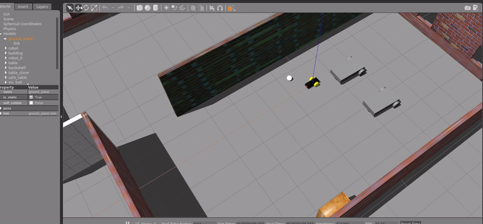
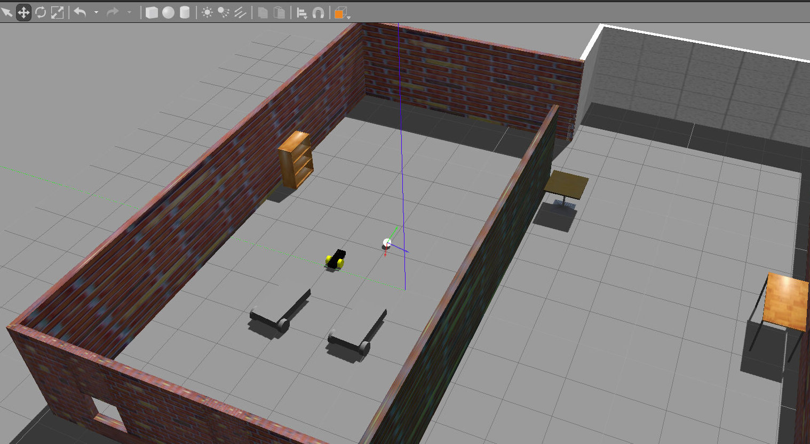

# ROS-Autonomous Ball Chasing Bot

## Overview
The ball chaser node is responsible for tracking a ball in the camera frame and using a PID controller to chase the ball. It's a straight forward project I did to learn the basics of ROS.

**Keywords:** ROS, OpenCV, Gazebo, PID


### License

The source code is released under a [Apache License 2.0](/LICENSE).

**Author: Abhigya Raval<br />
Maintainer: Abhigya Raval, abhigyaraval@gmail.com**

The packages has been tested under [ROS] Kinetic on Ubuntu 16.04.




**Gazebo env**



## Installation

### Building from Source

<!-- #### Dependencies

- [Robot Operating System (ROS)](http://wiki.ros.org) (middleware for robotics),
- [Eigen] (linear algebra library)

	sudo rosdep install --from-paths src -->

#### Building

To build from source, clone the latest version from this repository into your catkin workspace and compile the package using
```
cd catkin_ws
catkin_make
source devel/setup.bash
```
<!-- ### Running in Docker

Docker is a great way to run an application with all dependencies and libraries bundles together.
Make sure to [install Docker](https://docs.docker.com/get-docker/) first.

First, spin up a simple container:

	docker run -ti --rm --name ros-container ros:noetic bash

This downloads the `ros:noetic` image from the Docker Hub, indicates that it requires an interactive terminal (`-t, -i`), gives it a name (`--name`), removes it after you exit the container (`--rm`) and runs a command (`bash`).

Now, create a catkin workspace, clone the package, build it, done!

	apt-get update && apt-get install -y git
	mkdir -p /ws/src && cd /ws/src
	git clone https://github.com/leggedrobotics/ros_best_practices.git
	cd ..
	rosdep install --from-path src
	catkin_make
	source devel/setup.bash
	roslaunch ros_package_template ros_package_template.launch -->

### Unit Tests

```
cd catkin_ws
catkin_make
source devel/setup.bash
```
To launch and deploy robot in the world

	roslaunch my_robot world.launch


<!-- ### Static code analysis

Run the static code analysis with

	catkin_make roslint_ros_package_template -->

## Usage

To run ball chasing node

```
cd catkin_ws
catkin_make
source devel/setup.bash
roslaunch my_robot world.roslaunch
roslaunch ball_chaser ball_chaser
```
